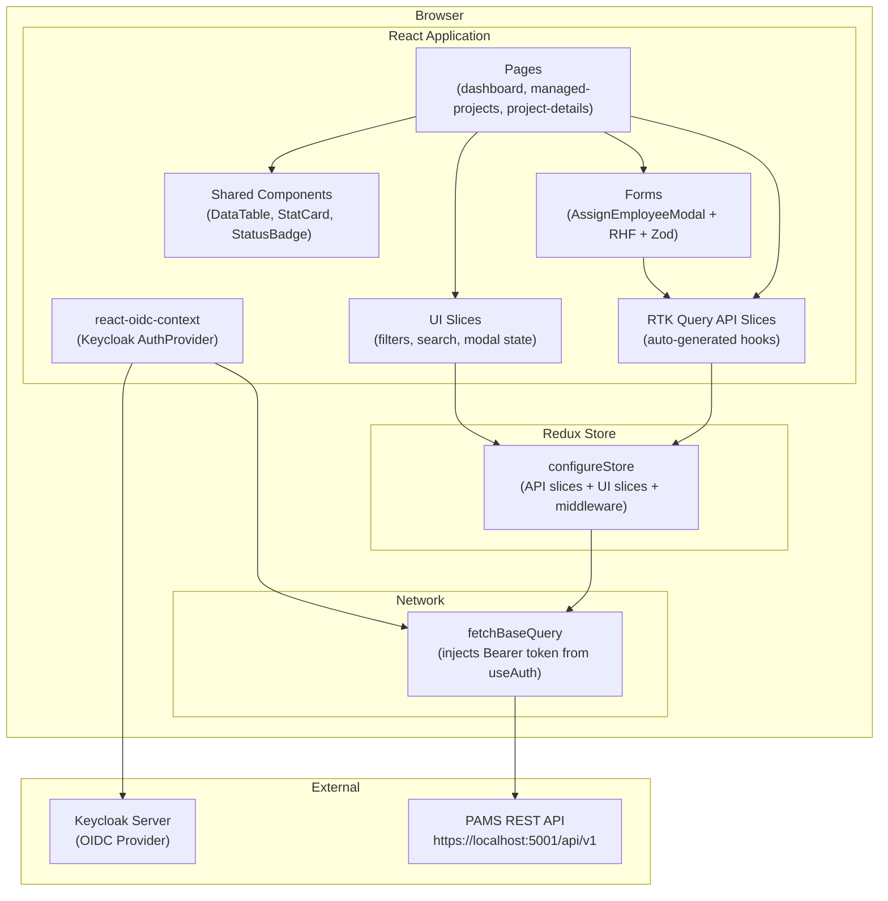
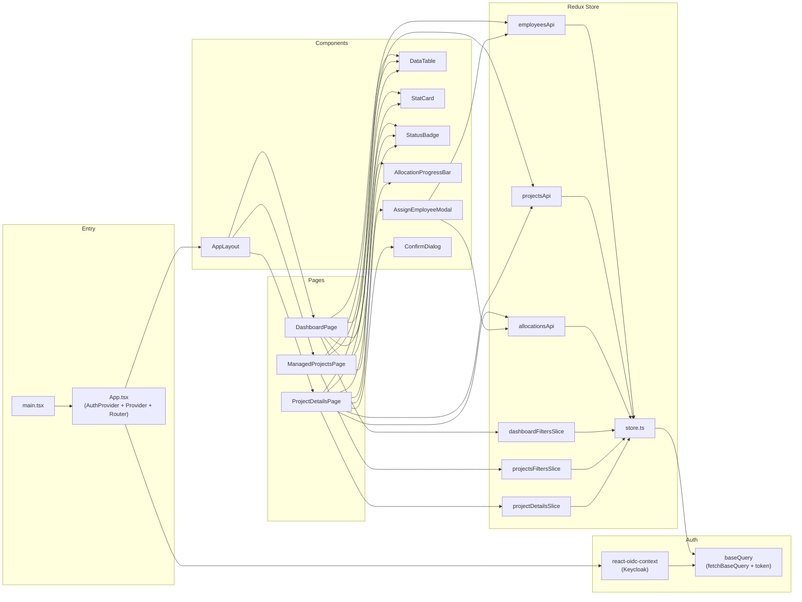

# NexFlow – Frontend Architecture (ProjectManager MVP)

> **Design Authority:** Senior Architect Agent
> **Status:** Draft — pending user review
> **Inputs:** `spec.md` (v1), `plan.md` (v1), `DESIGN.md` (v1)

---

## 1. Tech Stack & Dependency Rationale

| Library | Version | Purpose | Compatibility | Why chosen |
|---|---|---|---|---|
| **React** | 19.x | UI framework | Pure JS ✅ | Latest stable; required by spec |
| **Vite** | 6.x | Build tool / dev server | Pure JS ✅ | Fast HMR, best DX for React+TS |
| **TypeScript** | 5.x | Type safety | Pure JS ✅ | Spec mandates TS interfaces |
| **Tailwind CSS** | 4.x | Utility-first styling | Pure JS ✅ | DESIGN.md specifies Tailwind classes |
| **shadcn/ui** | latest | Component primitives (copy-into-project) | Pure JS ✅ | Spec mandates; built on Radix UI |
| **Radix UI** | latest | Accessible primitives (Dialog, Select, etc.) | Pure JS ✅ | Required by shadcn/ui |
| **Lucide React** | latest | Icon library | Pure JS ✅ | DESIGN.md specifies Lucide icons |
| **React Router** | 6.x | Client-side routing | Pure JS ✅ | 3 pages + navigation; industry standard |
| **@reduxjs/toolkit** (RTK Query) | 2.x | Server state, caching, client-side filtering | Pure JS ✅ | Built-in `createApi` for API layer + Redux store for client-side filter/search state; single state management solution |
| **react-redux** | 9.x | React ↔ Redux bindings | Pure JS ✅ | Required by RTK |
| **react-oidc-context** | 3.x | OIDC authentication (Keycloak) | Pure JS ✅ | Production-ready Keycloak integration; provides `useAuth()` hook for token, user, isAuthenticated |
| **oidc-client-ts** | 3.x | OIDC client library | Pure JS ✅ | Peer dependency of `react-oidc-context` |
| **React Hook Form** | 7.x | Form state management | Pure JS ✅ | Assign Employee modal form; performant, minimal re-renders |
| **Zod** | 3.x | Schema validation | Pure JS ✅ | Spec defines validation rules (min 25%, multiples of 5%); integrates with RHF via `@hookform/resolvers` |
| **MSW** | 2.x | API mocking (test only) | Pure JS ✅ | Plan mandates MSW for TDD; intercepts at network level |
| **Vitest** | 3.x | Test runner | Pure JS ✅ | Native Vite integration; Jest-compatible API |
| **React Testing Library** | 16.x | Component testing | Pure JS ✅ | User-centric testing; spec's TDD methodology |
| **@hookform/resolvers** | 3.x | Zod ↔ RHF bridge | Pure JS ✅ | Connects Zod schemas to React Hook Form |
| **class-variance-authority** | 0.7.x | Variant styling | Pure JS ✅ | Required by shadcn/ui components |
| **clsx** + **tailwind-merge** | latest | Class merging (`cn()` utility) | Pure JS ✅ | Required by shadcn/ui |

> **Auth:** Real Keycloak OIDC via `react-oidc-context`. No hardcoded tokens. The `<AuthProvider>` wraps the app root; all auth state (`user`, `isAuthenticated`, access token) is consumed exclusively via the `useAuth()` hook.

> **Rejected:** `better-sqlite3` (native), `sharp` (native), `axios` (unnecessary with RTK Query's `fetchBaseQuery`). All deps are pure JS with zero native compilation risk.

---

## 2. Project Folder Structure

```
src/
├── store/                          # Redux store + RTK Query API
│   ├── store.ts                    # configureStore (apiSlice + UI slices)
│   ├── hooks.ts                    # Typed useAppSelector / useAppDispatch
│   ├── api/                        # RTK Query — single API, split endpoints
│   │   ├── api-slice.ts            # createApi (single instance, baseQuery, tagTypes)
│   │   ├── allocations-api.ts      # injectEndpoints for allocations (CRUD + capacity-check)
│   │   ├── employees-api.ts        # injectEndpoints for employees (me, my-allocations, search)
│   │   └── projects-api.ts         # injectEndpoints for projects (managed list, details)
│   └── slices/                     # UI state slices (client-side filters/search)
│       ├── dashboard-filters-slice.ts    # Status filter, search text for Dashboard
│       ├── projects-filters-slice.ts     # Search, account filter, status filter for Managed Projects
│       └── project-details-slice.ts      # Modal open/close, selectedAllocation for edit
│
├── components/                   # Shared / reusable components
│   ├── ui/                       # shadcn/ui installed components (DO NOT hand-edit)
│   │   ├── button.tsx
│   │   ├── card.tsx
│   │   ├── dialog.tsx
│   │   ├── input.tsx
│   │   ├── select.tsx
│   │   ├── table.tsx
│   │   ├── badge.tsx
│   │   ├── skeleton.tsx
│   │   ├── toast.tsx
│   │   ├── toaster.tsx
│   │   ├── switch.tsx
│   │   ├── popover.tsx
│   │   ├── command.tsx           # for employee search combobox
│   │   ├── calendar.tsx          # for date pickers
│   │   └── alert-dialog.tsx      # for confirm dialogs
│   │
│   ├── layout/                   # Layout shell components
│   │   ├── app-layout.tsx        # Sidebar + Header + <Outlet />
│   │   ├── sidebar.tsx           # Dark nav sidebar (DESIGN.md §5.1)
│   │   └── page-header.tsx       # Reusable page header (title + actions)
│   │
│   ├── shared/                   # Composed reusable components
│   │   ├── status-badge.tsx      # Color-coded status badge (Active/Upcoming/Completed)
│   │   ├── allocation-progress-bar.tsx  # % bar with color ranges
│   │   ├── data-table.tsx        # Generic table wrapper (shadcn Table + pagination)
│   │   ├── confirm-dialog.tsx    # Destructive action confirmation
│   │   ├── employee-avatar.tsx   # Initials avatar + name/email
│   │   ├── stat-card.tsx         # Summary stat card (DESIGN.md §5.2)
│   │   ├── search-input.tsx      # Search with icon (DESIGN.md §5.10)
│   │   └── empty-state.tsx       # No-data placeholder
│   │
│   └── forms/                    # Form-specific composed components
│       └── assign-employee-modal.tsx  # Modal form for Create/Edit allocation
│
├── hooks/                        # Custom React hooks (non-RTK utilities)
│   ├── use-debounce.ts           # Debounce hook for search inputs
│   └── use-auth-token.ts         # Convenience wrapper around useAuth() for token access
│
├── pages/                        # Page-level components (one per route)
│   ├── dashboard-page.tsx        # Page 1: Manager Allocation Dashboard
│   ├── managed-projects-page.tsx # Page 2: Managed Projects list
│   └── project-details-page.tsx  # Page 3: Managed Project Details (hero screen)
│
├── types/                        # TypeScript interfaces & enums
│   ├── index.ts                  # All shared types re-exported
│   ├── project.ts                # Project, ProjectStatus
│   ├── allocation.ts             # Allocation, AllocationRecordStatus, AllocationStatus
│   ├── employee.ts               # Employee, EmployeeRole
│   └── api.ts                    # PaginatedResponse<T>, ApiError, CapacityCheckResponse
│
├── mocks/                        # MSW mock handlers + fixture data (test only)
│   ├── server.ts                 # MSW server setup (for Vitest)
│   ├── handlers/
│   │   ├── employee-handlers.ts  # GET /employees/me, /employees/me/allocations, /employees?search
│   │   ├── project-handlers.ts   # GET /projects, /projects/:projectCode
│   │   └── allocation-handlers.ts # POST/PUT/DELETE /allocations, capacity-check
│   └── fixtures/
│       ├── employees.ts          # Mock employee data
│       ├── projects.ts           # Mock project data
│       └── allocations.ts        # Mock allocation data
│
├── lib/                          # Utility functions
│   ├── utils.ts                  # cn() utility (shadcn)
│   └── constants.ts              # Pagination defaults, OIDC config keys, etc.
│
├── App.tsx                       # Root component (AuthProvider + Provider + Router)
├── main.tsx                      # Entry point (renders App)
└── index.css                     # Tailwind directives + CSS variables (DESIGN.md §2)
```

---

## 3. Data Flow Architecture



### Data Flow Rules
1. **Pages** are thin orchestrators — they dispatch RTK Query hooks + read UI slices, they do NOT fetch data directly.
2. **RTK Query API slices** own all server state — loading, error, data, caching, tag-based invalidation.
3. **UI slices** (Redux Toolkit `createSlice`) own client-side filter/search state — dispatched by page components.
4. **Components** are stateless presentational — they receive data via props.
5. **Forms** use React Hook Form + Zod for local form state; mutations go through RTK Query mutation hooks.
6. **Auth token** is injected into `fetchBaseQuery` via `prepareHeaders` using `useAuth()` from `react-oidc-context`.
7. **Client-side filtering** is done by selectors that filter the cached RTK Query data using UI slice state.

---

## 4. State Management Strategy

### Server State (RTK Query — `createApi`)
All API data is managed by RTK Query API slices. Each resource has its own `createApi` slice.

| API Slice | Auto-Generated Hooks | Cache Tag | Keep Unused Data |
|---|---|---|---|
| `employeesApi` | `useGetMeQuery`, `useGetMyAllocationsQuery`, `useSearchEmployeesQuery` | `'Employee'`, `'MyAllocations'` | 60s |
| `projectsApi` | `useGetManagedProjectsQuery`, `useGetProjectDetailsQuery` | `'Project'`, `'ProjectDetails'` | 60s |
| `allocationsApi` | `useCreateAllocationMutation`, `useUpdateAllocationMutation`, `useDeleteAllocationMutation`, `useCheckCapacityQuery` | `'Allocation'` | 30s |

### Client State (Redux Toolkit `createSlice`)
UI-only state for client-side filtering and search:

| Slice | State Shape | Purpose |
|---|---|---|
| `dashboardFilters` | `{ statusFilter: string, searchText: string }` | Filter Dashboard allocations table client-side |
| `projectsFilters` | `{ searchText: string, accountFilter: string, statusFilter: string }` | Filter Managed Projects table client-side |
| `projectDetails` | `{ isModalOpen: boolean, selectedAllocation: Allocation \| null, mode: 'create' \| 'edit' }` | Modal state for Assign Employee |

### Auth State (react-oidc-context — NOT in Redux)
Auth state lives in `react-oidc-context`'s internal React context. Accessed via `useAuth()` hook.
- `user` — OIDC user profile + claims (`empCode` from token claims)
- `isAuthenticated` — boolean
- `user.access_token` — Bearer token for API calls
- **Rule:** Auth state is NEVER duplicated into Redux.

### Tag-Based Cache Invalidation Map

| Mutation | Invalidates Tags |
|---|---|
| `createAllocation` | `['ProjectDetails']`, `['MyAllocations']` |
| `updateAllocation` | `['ProjectDetails']`, `['MyAllocations']` |
| `deleteAllocation` | `['ProjectDetails']`, `['MyAllocations']` |

### Client-Side Filtering Pattern

```ts
// Example: filter Dashboard allocations by status (client-side)
// In React 19, the React Compiler automatically memoizes this calculation.
// No manual `useMemo` is needed.

const { data: allocations } = useGetMyAllocationsQuery()
const statusFilter = useAppSelector((state) => state.dashboardFilters.statusFilter)

const filteredAllocations = !allocations 
  ? [] 
  : statusFilter === 'All' 
    ? allocations 
    : allocations.filter((a) => a.status === statusFilter)
```

---

## 5. TypeScript Interface Definitions

### Enums

```ts
// src/types/allocation.ts
type AllocationRecordStatus = 'Active' | 'Upcoming' | 'Ended'
type AllocationStatus = 'Bench' | 'Partial' | 'Full'

// src/types/project.ts
type ProjectStatus = 'Upcoming' | 'Active' | 'Completed'

// src/types/employee.ts
type EmployeeRole = 'HR' | 'ProjectManager' | 'Staff'

// Not used in PM MVP but defined for completeness:
type AccountType = 'Client' | 'Internal' | 'Bench'
```

### Core Interfaces

```ts
// src/types/project.ts
interface Project {
  projectCode: string
  projectName: string
  accountCode: string
  accountName: string
  projectManagerEmpCode: string
  status: ProjectStatus
  billable: boolean
  startDate: string   // ISO 8601
  endDate?: string
  isActive: boolean
  totalAllocatedPercentage?: number
  teamSize?: number
  availableCapacity?: number
}

// src/types/allocation.ts
interface Allocation {
  allocationId: string
  empCode: string
  employeeName: string
  employeeEmail?: string
  roleOnProject?: string
  projectCode: string
  projectName: string
  accountCode: string
  fromDate: string
  toDate?: string
  percentage: number
  billable: boolean
  status: AllocationRecordStatus
}

// src/types/employee.ts
interface Employee {
  empCode: string
  firstName: string
  lastName: string
  email: string
  designation: string
  role: EmployeeRole
  reportsToEmpCode?: string
  isActive: boolean
  currentAllocationStatus?: AllocationStatus
  currentAllocations?: Allocation[]
}
```

### API Layer Interfaces

```ts
// src/types/api.ts
interface PaginatedResponse<T> {
  data: T[]
  page: number
  limit: number
  totalCount: number
  totalPages: number
}

interface ApiError {
  code: string         // e.g., 'ERR_CAPACITY_EXCEEDED'
  message: string      // Human-readable error
  details?: Record<string, unknown>
}

interface CapacityCheckResponse {
  empCode: string
  currentTotalPercentage: number
  maxRecommendedRemaining: number
  isAvailable: boolean
}

// Form payload for creating/updating allocations
interface AllocationPayload {
  empCode: string
  projectCode: string
  fromDate: string     // YYYY-MM-DD
  toDate?: string      // YYYY-MM-DD
  percentage: number
  billable: boolean
}
```

---

## 6. API Layer Design (RTK Query `createApi` + `injectEndpoints`)

### Architecture: Single API Slice with Injected Endpoints

We use **one `createApi`** instance (the "API slice") as the single source of truth for all API configuration (base query, tag types, middleware). Individual resource endpoints are **injected** from separate files using `injectEndpoints`. This gives us:
- **Code splitting** — each resource file is independently importable
- **Modularity** — endpoints are co-located with their domain logic
- **Single middleware** — only one API middleware to register in the store

### Base API Slice (Single `createApi`)

```ts
// src/store/api/api-slice.ts — Conceptual design (NOT implementation code)
import { createApi, fetchBaseQuery } from '@reduxjs/toolkit/query/react'

// Token is injected per-request via prepareHeaders.
// The actual token comes from react-oidc-context's useAuth() hook,
// passed to the store via a module-level setter.
export const apiSlice = createApi({
  reducerPath: 'api',
  baseQuery: fetchBaseQuery({
    baseUrl: import.meta.env.VITE_API_BASE_URL,
    prepareHeaders: (headers) => {
      const token = getStoredToken() // set by AuthProvider on login
      if (token) {
        headers.set('Authorization', `Bearer ${token}`)
      }
      return headers
    },
  }),
  tagTypes: [
    'Employee',
    'MyAllocations',
    'Project',
    'ProjectDetails',
    'Allocation',
  ],
  endpoints: () => ({}), // Empty — endpoints injected from resource files
})
```

### Injected Endpoints — Employees

```ts
// src/store/api/employees-api.ts — Conceptual design
import { apiSlice } from './api-slice'

const employeesApi = apiSlice.injectEndpoints({
  endpoints: (builder) => ({
    getMe: builder.query<Employee, void>({
      query: () => '/employees/me',
      providesTags: ['Employee'],
    }),
    getMyAllocations: builder.query<Allocation[], void>({
      query: () => '/employees/me/allocations',
      providesTags: ['MyAllocations'],
    }),
    searchEmployees: builder.query<Employee[], string>({
      query: (search) => `/employees?search=${search}&isActive=true`,
    }),
  }),
})

export const {
  useGetMeQuery,
  useGetMyAllocationsQuery,
  useSearchEmployeesQuery,
} = employeesApi
```

### Store Configuration

```ts
// src/store/store.ts — Conceptual design
import { configureStore } from '@reduxjs/toolkit'
import { apiSlice } from './api/api-slice'
import { dashboardFiltersSlice } from './slices/dashboard-filters-slice'
import { projectsFiltersSlice } from './slices/projects-filters-slice'
import { projectDetailsSlice } from './slices/project-details-slice'

export const store = configureStore({
  reducer: {
    // Single RTK Query API reducer
    [apiSlice.reducerPath]: apiSlice.reducer,
    // UI state slices
    dashboardFilters: dashboardFiltersSlice.reducer,
    projectsFilters: projectsFiltersSlice.reducer,
    projectDetails: projectDetailsSlice.reducer,
  },
  middleware: (getDefaultMiddleware) =>
    getDefaultMiddleware().concat(apiSlice.middleware),
})

export type RootState = ReturnType<typeof store.getState>
export type AppDispatch = typeof store.dispatch
```

---

## 7. Routing Architecture

```ts
// React Router v6 route configuration

<Routes>
  <Route element={<AppLayout />}>
    <Route path="/" element={<Navigate to="/dashboard" replace />} />
    <Route path="/dashboard" element={<DashboardPage />} />
    <Route path="/managed-projects" element={<ManagedProjectsPage />} />
    <Route path="/managed-projects/:projectCode" element={<ProjectDetailsPage />} />
  </Route>
  <Route path="*" element={<Navigate to="/dashboard" replace />} />
</Routes>
```

### Sidebar Navigation Items (PM role)

| Label | Icon | Route | Active |
|---|---|---|---|
| Dashboard | `LayoutDashboard` | `/dashboard` | Match exact |
| Managed Projects | `Briefcase` | `/managed-projects` | Match prefix |
| Allocations | `Layers` | — | Disabled (future) |
| Resources | `Users` | — | Disabled (future) |

---

## 8. shadcn/ui Component Mapping

| Feature | shadcn/ui Components | Notes |
|---|---|---|
| Data tables (all pages) | `Table`, `TableHeader`, `TableRow`, `TableCell`, `TableBody`, `TableHead` | Wrapped in `DataTable` shared component |
| Stat cards | `Card`, `CardContent`, `CardHeader`, `CardTitle` | With custom stat layout |
| Status badges | `Badge` | Custom variants via CVA for Active/Upcoming/Completed |
| Buttons (primary, secondary, ghost) | `Button` | Variants: `default`, `outline`, `ghost` |
| Assign Employee modal | `Dialog`, `DialogContent`, `DialogHeader`, `DialogTitle`, `DialogDescription` | Radix Dialog under the hood |
| Confirm delete dialog | `AlertDialog`, `AlertDialogAction`, `AlertDialogCancel` | Destructive confirmation |
| Employee search combobox | `Popover` + `Command` + `CommandInput` + `CommandList` | Search-as-you-type |
| Date pickers | `Popover` + `Calendar` | From/To date fields |
| Filter dropdowns | `Select`, `SelectTrigger`, `SelectContent`, `SelectItem` | Status / Account filters |
| Billable toggle | `Switch` + `Label` | Toggle switch in modal |
| Form inputs | `Input`, `Label` | Allocation %, text fields |
| Search input | `Input` (with Lucide `Search` icon overlay) | All pages |
| Skeleton loaders | `Skeleton` | Table rows, stat cards |
| Toast notifications | `Toast`, `Toaster` (via `useToast`) | Success/error notifications |
| Pagination | Custom (`Button` variants) | Previous / Next with count |

---

## 9. Zod Validation Schema (Assign Employee Form)

```ts
// Conceptual schema — exact implementation in modal component
import { z } from 'zod'

const assignEmployeeSchema = z.object({
  empCode: z.string().min(1, 'Employee is required'),
  fromDate: z.string().min(1, 'Start date is required'),
  toDate: z.string().optional(),
  percentage: z
    .number()
    .min(25, 'Minimum allocation is 25%')
    .max(100, 'Maximum allocation is 100%')
    .refine((v) => v % 5 === 0, 'Must be a multiple of 5%'),
  billable: z.boolean().default(false),
})

type AssignEmployeeFormValues = z.infer<typeof assignEmployeeSchema>
```

---

## 10. Testing Strategy

### Tools
| Tool | Purpose |
|---|---|
| **Vitest** | Unit + integration test runner (Vite-native) |
| **React Testing Library** | Component rendering + user interaction |
| **MSW** | Network-level API mocking (shared between dev + test) |

### Coverage Goals

| Layer | Target | What's tested |
|---|---|---|
| **RTK Query Slices** | 100% | Each API endpoint: loading, success, error states, cache invalidation |
| **UI Slices** | 100% | Filter/search reducers, modal state transitions |
| **Pages** | 100% | Rendering with mock data, filter interactions, navigation |
| **Shared Components** | 100% | StatusBadge variants, ProgressBar ranges, DataTable pagination |
| **Forms** | 100% | Validation (Zod), submit success, submit error, edit pre-fill |

### Test File Naming Convention
```
src/pages/dashboard-page.test.tsx
src/store/api/employees-api.test.ts
src/store/slices/dashboard-filters-slice.test.ts
src/components/shared/status-badge.test.tsx
src/components/forms/assign-employee-modal.test.tsx
```

### MSW Test Setup
```ts
// src/mocks/server.ts
import { setupServer } from 'msw/node'
import { handlers } from './handlers'

export const server = setupServer(...handlers)

// vitest.setup.ts
beforeAll(() => server.listen())
afterEach(() => server.resetHandlers())
afterAll(() => server.close())
```

### TDD Flow (per plan.md)
1. **Red:** `frontend-testing` writes `*.test.tsx` → runs → confirms assertion failures
2. **Green:** `Frontend-developer` implements minimum code → test passes
3. **Refactor:** Clean up while green

---

## 11. Environment Variables

```env
# .env (local development)
VITE_API_BASE_URL=http://localhost:5000/api/v1
VITE_OIDC_AUTHORITY=http://localhost:8080/realms/pams
VITE_OIDC_CLIENT_ID=pams-web
VITE_OIDC_REDIRECT_URI=http://localhost:3000/callback
VITE_OIDC_POST_LOGOUT_REDIRECT_URI=http://localhost:3000

# .env.test (test environment — MSW intercepts, but base URL still needed)
VITE_API_BASE_URL=http://localhost:5000/api/v1
```

> All env variables prefixed with `VITE_` per Vite convention. No hardcoded endpoints or OIDC config in source code. The `empCode` claim is available on both access and ID tokens (custom Keycloak protocol mapper).

---

## 12. Module Dependency Graph



---

## 13. Key Architectural Decisions

| # | Decision | Rationale |
|---|---|---|
| **AD-1** | RTK Query for server state + Redux Toolkit for UI state | Single state management solution. RTK Query handles caching/fetching; `createSlice` handles client-side filtering, search text, and modal state. Unified dev tools (Redux DevTools). |
| **AD-2** | `fetchBaseQuery` (no Axios, no custom fetch) | RTK Query's built-in `fetchBaseQuery` wraps native `fetch` with serialization + error handling. No extra HTTP library needed. |
| **AD-3** | `react-oidc-context` + Keycloak from MVP | Backend + Keycloak are production-ready. No mock tokens. Real OIDC flow from day one — prevents auth integration surprises later. |
| **AD-4** | Auth state lives in `react-oidc-context` only (NOT in Redux) | Avoids state duplication. Token is read from `useAuth()` and injected into `fetchBaseQuery.prepareHeaders`. |
| **AD-5** | Client-side filtering via Redux selectors | API fetches full datasets; filtering/searching happens in `useMemo` selectors reading from UI slices. This avoids redundant API calls for simple filter changes. |
| **AD-6** | One modal component for Create + Edit | Same form fields; modal receives optional `existingAllocation` prop. Reduces component count. |
| **AD-7** | MSW for tests only (not dev) | Backend is fully functional — MSW is only needed for Vitest test isolation. |
| **AD-8** | File-per-API-slice pattern | Each resource (`employees`, `projects`, `allocations`) gets its own `createApi` slice. Keeps slices focused and testable. |
| **AD-9** | shadcn/ui `DataTable` composition | Use shadcn's `Table` primitives composed into a reusable `DataTable` component with pagination, rather than installing `@tanstack/react-table`. Keeps things simple for MVP. |

---

## Review Gate

> **Implementation plan can now be generated based on this architecture.**
>
> All dependencies are pure-JS with zero native compilation risk. The folder structure, interfaces, data flow, and testing strategy are defined. The `plan.md` phase breakdown aligns with this architecture.
